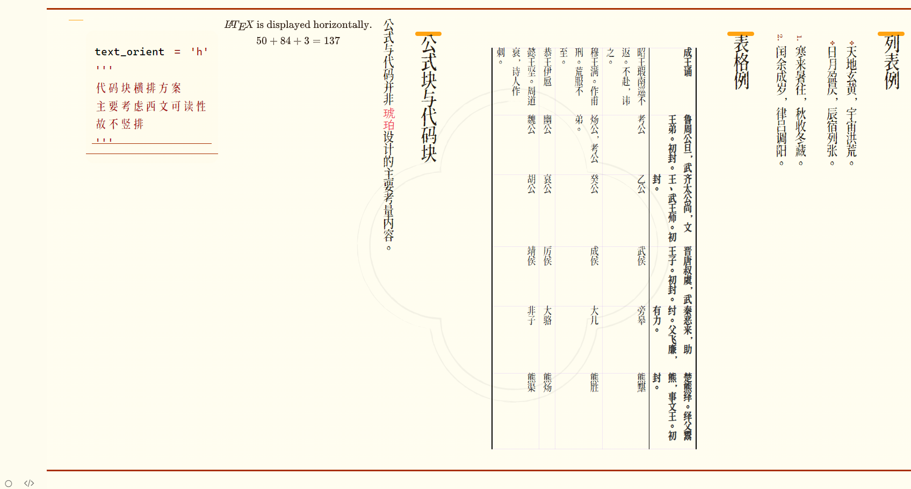

# amber-vertical-typora-theme


## Background

琥珀是第一款符合传统汉字纵向排版习惯的Typora主题。 Amber is the first vertical Typora theme that conforms to the tradition of ancient Chinese typography.

## Download 
**This theme is tested in Typora version 1.8.10, on Windows 10 system.**

``` git clone "github.com.cnpmjs.org/MichaelLaw2003/amber-vertical-typora-theme.git" ```

Or download this repository directly from this page: `< > code` -- `Download zip`.

URL: "https://github.com/MichaelLaw2003/amber-vertical-typora-theme/archive/refs/heads/main.zip" .

## Usage
Unzip the package and copy 
1. `amber.css`
2. `amber` folder

to the Typora Theme folder.


## Introduction

*琥珀*是第一款符合汉字传统书写和印刷习惯的Typora主题。

### 风格

*琥珀*基于*Haru*主题设计，希望可以作为日后竖版模板之基础。

*琥珀*之设计以明刻本《[李长吉歌诗](https://old.shuge.org/ebook/li-changji-ge-shi/)》为主要风格参考，并综合参考简牍、手卷、印鉴、笺纸等多种其他资料。

本项目受到日本设计中心应用程序Stone启发，并蒙书格网、「古书之美」应用程序提供参考资料。

### 设计

*琥珀*支持简体汉字、繁體漢字、Latin letters。

中文字体为令東齊伋體。

意大利体(*Italic*)匹配字体为*霞鹜文楷*。

*意大利体*、==强调==、**粗体**等特殊风格参考了*Rubrication*主题。

### 目标场景

- 诗歌、散文、小说写作。
- 简单的古籍风格化。
- 其他需要传统排版风格的场合。
- 作为其他竖排样式的基准。

## 风格案例




## Known Problems and TODO
1. 回鹘蒙古文和满文等可能显示异常
2. 勾选框可能显示异常
3. This theme is compatible with Japanese and Korean, but lacks special fonts and other style.
